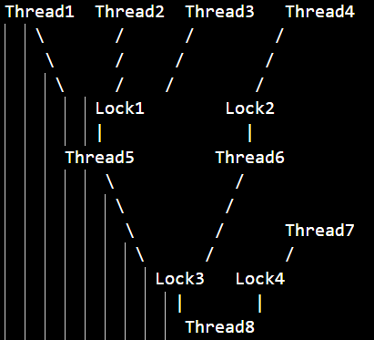
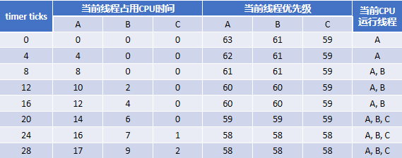

# PROJECT 1: THREADS DESIGN DOCUMENT

## ALARM CLOCK

#### QUESTION A1:

> > Copy here the declaration of each new or changed `struct' or  
`struct' member, global or static variable, `typedef', or
> > enumeration. Identify the purpose of each in 25 words or less.

答：  
struct thread
int64_t ticks_blocked;  
 //用来记录线程需要睡眠的时间+从系统启动到目前的时间

### ---- ALGORITHMS ----

#### QUESTION A2:

> > Briefly describe what happens in a call to timer_sleep(),
> > including the effects of the timer interrupt handler.

答：  
<<<<<<< HEAD
  
=======
>>>>>>> c013e31258a9b29c52d340860f98a93edde9402b
当执行 timer_sleep()函数后，直接调用 thread_sleep()函数，在此函数中先初始化线程的属性 ticks_blocked，记录下线程需要睡眠的时间+从系统启动到目前的时间，之后在关中断的情况下将睡眠线程睡眠时间顺序
从小到大插入阻塞队列，然后将线程阻塞，最后开中断。在中断处理程序中，直接调用 thread_wakeup()函数，通过检测从系统启动到目前的时间是否大于线程的 ticks_blocked 时间来判断是否唤醒线程，如果唤醒则
在关中断的情况下将线程移出阻塞队列，并且将其 unblock。

#### QUESTION A3:

> > What steps are taken to minimize the amount of time spent in
> > the timer interrupt handler?

答：  
<<<<<<< HEAD
  
=======
>>>>>>> c013e31258a9b29c52d340860f98a93edde9402b
因为被阻塞的线程状态被设置为 THREAD_BLOCKED，同时我们设置了一个阻塞队列，而且阻塞队列是按照阻塞时间从小到大排序的，所以在中断处理程序中只会遍历前几个拥有最短睡眠时间的线程，
之前需要遍历目前系统中的所有线程，我们的方法大大缩短了中断处理程序的时间花费。

### ---- SYNCHRONIZATION ----

#### QUESTION A4:

> > How are race conditions avoided when multiple threads call
> > timer_sleep() simultaneously?

答：
<<<<<<< HEAD

=======
>>>>>>> c013e31258a9b29c52d340860f98a93edde9402b
old_level = intr_disable();
list_insert_ordered(&sleep_list, &cur->elem, sleep_ticks_less, NULL);
thread_block();
intr_set_level(old_level);
这里通过禁用中断使得阻塞线程的操作可以避免竞争，保证操作的原子性。

#### QUESTION A5:

> > How are race conditions avoided when a timer interrupt occurs
> > during a call to timer_sleep()?

答：  
与 A4 一样，也是在 timer_sleep()函数中关键位置加入禁用中断，这样使计数器的中断不会和 timer_sleep 发生竞争。

#### QUESTION A6:

> > Why did you choose this design? In what ways is it superior to
> > another design you considered?

答：  
我们认为需要将线程的睡眠时间与线程绑定才可以在检测到线程时根据其自己的睡眠时间属性来完成睡眠，所以我们先将睡眠时间加入到了线程的结构体中。
之后由于需要通过中断处理程序来完成线程的睡眠控制任务，所以在 timer_sleep 函数中就直接阻塞线程并将其加入阻塞队列即可。之后我们在中断处理函数中加
入遍历阻塞队列然后通过时间比较来唤醒的函数，这样可以使唤醒函数的时间开销减少，与之前的遍历所有线程相比我们方法降低了时间复杂度。

## PRIORITY SCHEDULING

### ---- DATA STRUCTURES ----

#### QUESTION B1:

> > Copy here the declaration of each new or changed `struct' or
`struct' member, global or static variable, `typedef', or
> > enumeration. Identify the purpose of each in 25 words or less.

答：  
struct thread
int base_priority; // 基础优先级
int locks_priority; // 线程持有的锁中最高优先级
struct list locks; // 记录线程持有的锁
struct lock \*lock_waiting; // 记录线程等待的锁

struct lock
struct thread \*holder; //锁的拥有者
struct list waiters; //等待锁的队列
struct list_elem elem; //链表中的锁元素的实例
int priority; //锁的优先级

#### QUESTION B2:

> > Explain the data structure used to track priority donation.
> > Use ASCII art to diagram a nested donation. (Alternately, submit a
> > .png file.)

答:

<<<<<<< HEAD

=======

>>>>>>> c013e31258a9b29c52d340860f98a93edde9402b

|表示拥有，/或者\表示等待。
在上述图中，Thread5 拥有（holder）Lock1，Thread6 拥有（holder）Lock2，Thread8 拥有（holder）Lock3 和 Lock4。
Thread1、Thread2 和 Thread3 在等待（lock_waiting）Lock1，Thread4 在等待（lock_waiting）Lock2，Thread5 和 Thread6 在等待（lock_waiting）Lock3，Thread7 在等待（lock_waiting）Lock4。
Thread1,2,3,4,7 没有持有的锁（locks 为空），Thread5 持有的锁（locks）为 Lock1，Thread6 持有的锁（locks）为 Lock2，Thread8 持有的锁（locks）为 Lock3,4。
根据上述数据结构，在可能改变线程的优先级的函数中都实现了优先级的捐赠，在 lock_acquire 中使用嵌套捐赠，在 lock_release 中使用 thread_update_priority 实现线程优先级恢复，使用
lock_update_priority 实现锁的优先级恢复。thread_set_priority 保证线程优先级能够正确设置。综上此部分中的 lock_acquire,lock_release,thread_update_priority,lock_update_priority 四个函数
保证了线程和锁的优先级能够被正确更新，也能够正确完成优先级捐赠。

### ---- ALGORITHMS ----

#### QUESTION B3:

> > How do you ensure that the highest priority thread waiting for
> > a lock, semaphore, or condition variable wakes up first?

答：  
我们通过维护等待锁、信号量和条件变量的等待队列为优先级队列，即队首元素都为优先级最高的线程来保证每次获得上述三个资源的线程都是优先级最高的线程。

#### QUESTION B4:

> > Describe the sequence of events when a call to lock_acquire()
> > causes a priority donation. How is nested donation handled?

答：  
<<<<<<< HEAD
  
=======
>>>>>>> c013e31258a9b29c52d340860f98a93edde9402b
当我们调用到 lock_acquire()函数时，首先要禁用中断，再执行后续获取锁的步骤。如果有某个线程拥有此把锁，则我们需要将当前线程放到等待这把锁的队列中去，然后设置当前线程的 lock_waiting 为这把锁。
之后就开始嵌套捐赠优先级，这样可以使当前线程尽快获得此把锁。在嵌套捐赠优先级中，我们首先判断当前线程的优先级是否比等待的锁的优先级高，如果高那么先给锁捐赠线程的高优先级，接着判断当前锁的
优先级（其实已经是最初的线程的优先级了）是否大于其拥有者拥有的锁中的最高优先级，如果是则给拥有者拥有的锁中的优先级捐赠最初线程的高优先级，最后判断当前锁的优先级（也是最初的线程的优先级）是否
高于拥有者自己的优先级，如果是则给其赋值高优先级，下一轮循环接着捐赠现在线程的优先级给他等待的锁，这样就可以使最初线程等待的锁以及锁的拥有者快速获得高优先级从而快速执行结束，从而快速让最初线
程能够执行，这就是 nested 的全过程。如果没有线程拥有此把锁，那么直接将此把锁添加到当前线程的 locks 队列中，之后如果锁的优先级高，那么也相应提升线程的优先级。

#### QUESTION B5:

> > Describe the sequence of events when lock_release() is called
> > on a lock that a higher-priority thread is waiting for.

答：  
当我们调用到 lock_release()函数时，首先要禁用中断保持后续操作的原子性，之后先将此把锁从线程拥有的锁的队列中去除，之后使用 thread_update_priority 函数进行优先级更新，
该线程的优先级将变为原来的优先级和拥有的其余锁中最大优先级。接着我们需要从锁的等待队列中删除此线程，然后使用 lock_update_priority 函数更新锁的优先级，之后唤醒线程，将其挂起。

### ---- SYNCHRONIZATION ----

#### QUESTION B6:

> > Describe a potential race in thread_set_priority() and explain
> > how your implementation avoids it. Can you use a lock to avoid
> > this race?

答：  
当设置一个线程的优先级时，如果此线程处于被捐赠状态，则需要先修改其 base_priority 为 new_priority，接着通过比较新优先级和线程拥有的锁中的最大优先级谁更高，来设置线程的当前优先级。
但是当修改线程当前优先级的时候如果此优先级又被捐赠，如果捐赠的优先级还是最高，那么可能会错误地将线程的当前优先级更新为 new_priority 而不是捐赠的高优先级。所以此处的解决方法是禁用
中断，将修改优先级的操作变为原子操作，这样就不会发生上述情况了。
如果使用锁来避免竞争，需要在线程的结构体中增加一个专门控制修改的锁，在 thread_set_priority,thread_priority_donate_nest,thread_update_priority 三个函数中都实现修改优先级前获取锁，
修改完后释放锁，这样就可以使改变优先级的操作为原子操作，不会发生竞争，同时此锁只是控制修改的功能，不需要加入任何有关锁的队列中。

### ---- RATIONALE ----

#### QUESTION B7:

> > Why did you choose this design? In what ways is it superior to
> > another design you considered?

答：  
我们首先选择了使用了优先级队列来维持每次获取锁、信号量和条件变量的等待队列，这样的好处是可以每次直接取队首的优先级最高的线程，这样就完成了优先级高的线程先执行的功能。之后为了完成
优先级捐赠这个任务，我们给锁设置了一个优先级，这个优先级可以使线程所拥有的锁的队列成为一个优先级队列。在捐赠优先级的过程中，由于一个线程直接获取的资源就是锁，所以直接通过锁去捐赠优先级
是更为合理的，这样我需要哪个锁就给锁捐赠我的高优先级，然后通过锁这个渠道再给他的拥有者捐赠优先级，这样的嵌套捐赠是比较符合逻辑的，且执行效率较高。同时这样还可以使在释放锁时直接将其从线程
拥有的锁队列中去掉即可。相比于记录每个可能对当前线程产生捐赠行为的其他线程，然后再寻找最大优先级，释放锁时还需要找到需要 remove 的对应线程，我们现在的设计节省了空间和时间，并且更加方便。

## ADVANCED SCHEDULER

### ---- DATA STRUCTURES ----

#### QUESTION C1:

> > Copy here the declaration of each new or changed `struct' or
`struct' member, global or static variable, `typedef', or
> > enumeration. Identify the purpose of each in 25 words or less.

答：  
struct thread
fixed_t recent_cpu; //线程的 recent_cpu  
 int nice; //线程的 nice  
static fixed_t load_avg; //全局变量 load_avg

### ---- ALGORITHMS ----

#### QUESTION C2:

> > Suppose threads A, B, and C have nice values 0, 1, and 2. Each
> > has a recent_cpu value of 0. Fill in the table below showing the
> > scheduling decision and the priority and recent_cpu values for each
> > thread after each given number of timer ticks:

答：  
<<<<<<< HEAD

=======

>>>>>>> c013e31258a9b29c52d340860f98a93edde9402b

#### QUESTION C3:

> > Did any ambiguities in the scheduler specification make values
> > in the table uncertain? If so, what rule did you use to resolve
> > them? Does this match the behavior of your scheduler?

答：  
是存在一些歧义的。按照文档中所说，在每一拍之后都要使 recent_cpu 加 1，每四拍后需要更新 priority，所以这里哪个量先更新就有些不清楚了，这会影响上表的结果。我们认为先更新 recent_cpu 再更新
priority，在我们的程序中也是这样的。

#### QUESTION C4:

> > How is the way you divided the cost of scheduling between code
> > inside and outside interrupt context likely to affect performance?

答：  
如果在 scheduling 的部分花费太多时间的话，真正用来运行线程的 CPU 时间就少了，那么 CPU 的性能就会下降。所以应当尽量减少花费在 scheduling 部分的时间。

### ---- RATIONALE ----

#### QUESTION C5:

> > Briefly critique your design, pointing out advantages and
> > disadvantages in your design choices. If you were to have extra
> > time to work on this part of the project, how might you choose to
> > refine or improve your design?

答：  
为了实现方便，我们并没有实现 64 个优先级队列，而是只利用最初的 ready 队列实现了这个任务。我们将 yield 的线程放在 ready 队列的尾部，然后从整个 ready 队列中找到优先级最高的线程作为下一个运行
的线程，这样也就是从最高优先级队列中找到了最高优先级线程进行运行，并且如果存在多个优先级相等线程，先运行前面的，这样其实就模拟了一个多级队列反馈调度，实现了 Round Robin 机制。
这样的优点在于实现起来简单，但是缺点就是时间复杂度会达到 O(n)，如果存在很多线程，这样寻找最高优先级的线程就比较浪费时间。
如果有更多的时间，我们会真正实现 64 个优先级队列，这样可以提高效率，减少中断部分代码占有 CPU 的时间。

#### QUESTION C6:

> > The assignment explains arithmetic for fixed-point math in
> > detail, but it leaves it open to you to implement it. Why did you
> > decide to implement it the way you did? If you created an
> > abstraction layer for fixed-point math, that is, an abstract data
> > type and/or a set of functions or macros to manipulate fixed-point
> > numbers, why did you do so? If not, why not?

答：  
我们没有使用一个类来封装定点数，而是直接用 int 变量来保存定点数。我们在 fixed_point.h 文件中定义了若干个函数来进行定点数的各种运算，因为我们觉得定点数的某些运算使用比较频繁，
封装到函数中可以提高代码的可读性，减少出错的可能。

# PROJECT 2: USER PROGRAMS

## ARGUMENT PASSING

### ---- DATA STRUCTURES ----

#### QUESTION A1:

> > Copy here the declaration of each new or changed `struct' or
`struct' member, global or static variable, `typedef', or
> > enumeration. Identify the purpose of each in 25 words or less.

答：  
第一个任务参数传递中只需要对于函数进行一定修改补充，不需要添加新的数据结构。

### ---- ALGORITHMS ----

#### QUESTION A2:

> > Briefly describe how you implemented argument parsing. How do
> > you arrange for the elements of argv[] to be in the right order?
> > How do you avoid overflowing the stack page?

答：  
<<<<<<< HEAD
  
=======
>>>>>>> c013e31258a9b29c52d340860f98a93edde9402b
在参数解析中，我们只需要在 process_excute()和 start_process()函数中使用 strtok_r()函数按照空格将文件名和之后的参数分开即可，因为一个命令第一个参数都是文件名，之后的参数都是一些功能选项。
我们将解析后的文件名传入线程作为线程名，参数（包括线程名）压入系统栈使可执行文件可以正确读取，就完成参数的传递。
我们在将参数压入系统栈的时候，要从右到左进行压入，也就是先压入命令中的最后一个参数，文件名这个参数作为位于最低地址的一个参数，这样就能够保证参数的顺序是正确的。通过从 PHYS_BASE 处向下
开始压入参数，可以保证不会向上发生溢出，避免了 overflowing 的发生。

### ---- RATIONALE ----

#### QUESTION A3:

> > Why does Pintos implement strtok_r() but not strtok()?

答：  
<<<<<<< HEAD
因为 strtok_r()比 strtok()在线程上更加具有安全性。strtok_r 函数是 strtok 函数的可重入版本。strtok 函数在提取字符串时使用了静态缓冲区，一个字符串被分离过程中
的一些局部变量被存储在静态缓冲区中，此时如果包含 strtok 函数程序被其他进程使用，那么静态缓冲区内的局部变量会混乱，因此，它是线程不安全的。而对于 strtok_r
函数，其没有静态缓冲区，每个线程要分割的字符串局部变量存储在自己的数据区内，这样就将包含 strtok_r 函数的代码变为了纯代码。所以为了保证线程的安全，在 pintos
中使用了 strtok_r()函数。
=======
因为 strtok_r()比 strtok()在线程上更加具有安全性。strtok_r 函数是 strtok 函数的可重入版本。strtok_r()函数中的 char \**saveptr 参数是一个指向 char *的指针变量，
用来在 strtok_r 内部保存切分时的上下文，以应对连续调用分解相同源字符串。strtok 函数在提取字符串时使用了静态缓冲区，因此，它是线程不安全的。所以为了保证
线程的安全，在 pintos 中使用了 strtok_r()函数。
>>>>>>> c013e31258a9b29c52d340860f98a93edde9402b

#### QUESTION A4:

> > In Pintos, the kernel separates commands into a executable name
> > and arguments. In Unix-like systems, the shell does this
> > separation. Identify at least two advantages of the Unix approach.

答：  
1、将可执行名称和参数分离的做法有助于系统得知此时要执行的文件是什么，要完成的功能有哪些，更加方便命令的输入与参数的解析和传递。  
2、此种分离有助于添加更多的功能选项，这种分离的方式可以在命令中传入很多参数，系统可以解析和传递任意数量参数，一次可以执行很多的任务，有助于提升任务的完成效率。
